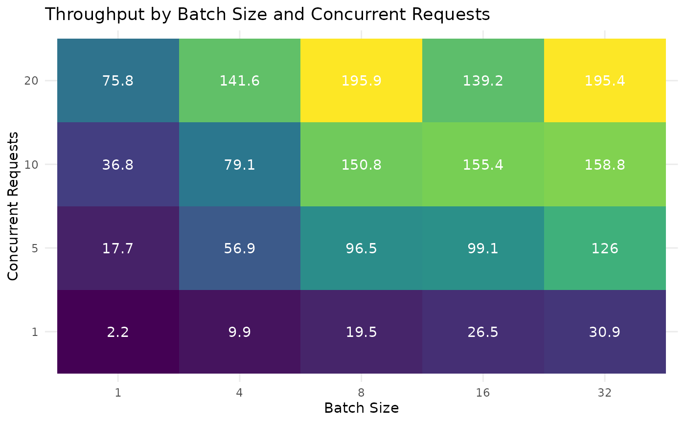

# Improving Performance

In this vignette we’ll look at strategies for improving the throughput
and performance of EndpointR’s functions. Our goal will be to move from
sending single requests to sending multiple batches simultaneously.

Before we get into how, let’s go a bit further into why.

## Understanding the Time Problem

For each row of our data frame, we need to create a request which we
will then perform. We perform the request by sending our information
over the internet to the endpoint. The endpoint accepts our request,
performs any computation, and sends a successful response or an error.
Each step has an associated cost in time, and the cost for each step is
not equal - some steps are more costly than others.

Creating each request is almost instant, but if we have a larger data
frame - e.g. with 100,000 rows: creating 100,000 requests simultaneously
will take $\approx$ 30s-90s. If we create them all at once, we’ll have
to wait the full amount of time before we begin sending requests.
Clearly this is wasteful - if we had created the first request and sent
it, we would save at least 90 seconds.

Sending each request to the endpoint and waiting for it to process will
usually take a lot longer than preparing the request. Therefore, if we
can find ways to reduce the time we spend waiting here, we should be
able to reduce the overall time it takes to prepare and send our
requests significantly.

> This vignette will focus mainly on the
> [`hf_embed_df()`](https://jpcompartir.github.io/EndpointR/reference/hf_embed_df.md)
> function and the options we have for improving throughput of requests.
> The same ideas apply to the
> [`hf_classify_df()`](https://jpcompartir.github.io/EndpointR/reference/hf_classify_df.md)
> function, and some ideas transfer to other providers and their
> functions, e.g. `oai_*()`.

## Set Up

``` r
library(tibble)
library(tidyr)
library(EndpointR)
library(ggplot2)
library(httr2)
library(dplyr)
```

TODO: Copied from hugging_face_inference.Rmd, need to re-order and edit

We’ll need some data, so we’ll grab the same sentences and data frame
from the [introductory
vignette](https://jpcompartir.github.io/EndpointR/articles/articles/hugging_face_inference)
on Hugging Face Inference:

``` r
embedding_sentences <- c(
  "Text embedding models compress your rambling prose into compact vectors, much like how British commuters squeeze themselves into tube carriages during rush hour.",
  "Setting up an inference endpoint without proper documentation is akin to attempting to navigate London using a map of Birmingham.",
  "When your embedding model starts hallucinating, it's rather like watching Parliament during Question Time—entertaining but utterly unpredictable.",
  "Optimising your inference endpoint is essential unless you fancy your users growing old whilst waiting for a response, perhaps even ageing enough to collect their pension.",
  "The distance between word embeddings reveals semantic relationships, though sadly not the distance between what your client requested and what they actually wanted.",
  "Creating multilingual embeddings is a bit like attempting to order tea properly across Europe—technically possible but fraught with cultural misunderstandings.",
  "Batch processing through inference endpoints saves computing resources, much like how the British save conversation topics by discussing the weather exclusively.",
  "Token limits on embedding APIs are the digital equivalent of a queue at a British post office—inevitably, you'll reach the front just as they close for lunch.",
  "Fine-tuning embedding models on domain-specific corpora is rather like training a British child to apologise—it requires repetition, patience, and considerable examples.",
  "When your inference endpoint crashes under load, it maintains that quintessentially British trait of breaking down precisely when most inconvenient."
)

embedding_ids <- 1:10

embedding_df <-
  tibble(
    id = embedding_ids,
    sentence = embedding_sentences
  )
```

> **WARNING**: To follow along you will need to provide your own
> endpoint_url and set your own API key. I am using an encrypted URL for
> security purposes. `ENDPOINTR_KEY` is a person-specific (i.e. you
> should not have access to my key) environment variable which can be
> used to encrypt any information, and should be stored securely
> offline, and not committed to GitHub or other online services.

``` r
endpoint_url <- httr2::secret_decrypt("kcZCsc92Ty7PuAk7_FdCcdOU_dlDpvWdDyfpwCWg-wW80eJxJPdQ68nz4V_0922SzSwM5_dYfpTOqsZ-GodUpLN4PQbwE73wlZkBCWIaIXc15g", "ENDPOINTR_KEY")
```

## Improving Performance - Time

For the `hf_embed_df` function, our main options are to increase the
number of requests we send simultaneously, and the number of texts we
send within each request.

- `concurrent_requests` lets EndpointR know how many requests to send at
  the same time. This should be a number between 1 and ~20-50 (in
  extreme cases you may be ok with 100, but most endpoints will not
  accept this)
- `batch_size` lets EndpointR know whether to send requests with
  individual texts, or with a number of texts ‘batched up’ together.

### Solution 1: Concurrent Requests

Hugging Face Inference Endpoints can handle multiple requests arriving
at the same time. The goal is to send just under the maximum number of
requests the endpoint can handle. For example, an endpoint with a
powerful GPU may be able to handle hundreds of documents at a time,
whereas an endpoint with a small CPU will be able to handle only a
handful.

As a guide, start with ~5 concurrent requests, and work up to ~20. If
you start hitting rate limits go back down to ~10 and find the
sweetspot. If the endpoint is handling 20 requests without returning
rate limit errors, you could experiment with \> 20 requests.

> \*\*TIP\*:: Endpoints can be configured to ‘autoscale’ - meaning they
> will provide additional hardware when the number of queued requests is
> above the configured threshold for the configured duration of time.

Here we send 5 concurrent requests - this will iterate through the data
frame 5 rows at a time, and send new requests when responses are
returned, until we run out of data to embed.

``` r
hf_embed_df(
  df = embedding_df,
  text_var = sentence,
  endpoint_url = endpoint_url,
  key_name = "HF_TEST_API_KEY",
  id_var= id,
  concurrent_requests = 5,
  batch_size = 1,
  progress = TRUE
)
```

Let’s benchmark performance (see appendix for code) - there is some
overhead associated with generating parallel requests, so we’ll need a
bigger data frame to understand what type of speed up we can get.

``` r
id_1000 <- 1:1000
sentences_1000 <- rep(embedding_df$sentence, 100)
embedding_df_1000 <- tibble(id = id_1000, sentence = sentences_1000)
```

Recording the results: we can see a ~40% reduction in processing time
when going from 5-\> 10 concurrent requests and a ~15% reduction when
going from 10 -\> 20 concurrent requests.

| concurrent_requests | processing_time_secs | success |
|--------------------:|---------------------:|:--------|
|                   5 |                 19.8 | TRUE    |
|                  10 |                 11.9 | TRUE    |
|                  20 |                 10.2 | TRUE    |

\*Exact times will fluctuate, so take these as approximates.

### Solution 2: Batching Requests

Another method for reducing processing time is to send more data within
each request. This will mean we can send fewer requests overall, and
reduce time spent sending information over the network. Sending multiple
rows of data within each request creates a batch request.

If we have 1,000 rows of data, `batch_size = 10` will result in 100
requests being sent, instead of the 1,000 with `batch_size = 1`.

> **TIP**: experiment with batch sizes to find the sweetspot - usually
> starting around 8-16, and capping out at ~64. You’ll know when you’ve
> gone too high because you’ll start seeing the retry bar, and/or your
> responses will contain errors.

``` r
hf_embed_df(
  df = embedding_df_1000,
  text_var = sentence,
  endpoint_url = endpoint_url,
  key_name = "HF_TEST_API_KEY",
  id_var= id,
  concurrent_requests = 1,
  batch_size = 20,
  progress = TRUE
)
```

### Solution 3: Combining Concurrency and Batching

For maximum speed up, we can also send batches of multiple concurrent
requests. If our endpoint is able to handle them, 10 concurrent requests
of `batch_size = 10` will be faster than 10 concurrent requests of
`batch_size = 5`.

## Benchmarking Solutions

In a separate session and using a dataset which is not available in the
package, we explored the relationship between batch size, concurrent
requests, and throughput ; where throughput is the number of rows
processed per second. We looked at combinations of:

- **batch_size = c(1, 4, 8, 16, 32)**
- **concurrent_requests = c(1, 5, 10, 15, 20)**

``` r
data(batch_concurrent_benchmark, package = "EndpointR")

knitr::kable(batch_concurrent_benchmark |> mutate_if(is.numeric, ~ round(.x, 2)))
```

| batch_size | concurrent_requests | chunk_index | elapsed_time | success | rows_processed | throughput |
|-----------:|--------------------:|------------:|-------------:|:--------|---------------:|-----------:|
|          1 |                   1 |           2 |       921.77 | TRUE    |           1995 |       2.16 |
|          1 |                   5 |           3 |       112.84 | TRUE    |           1996 |      17.69 |
|          1 |                  10 |           4 |        54.37 | TRUE    |           1998 |      36.75 |
|          1 |                  20 |           5 |        26.38 | TRUE    |           1999 |      75.77 |
|          4 |                   1 |           6 |       200.85 | TRUE    |           1996 |       9.94 |
|          4 |                   5 |           7 |        35.10 | TRUE    |           1997 |      56.90 |
|          4 |                  10 |           8 |        25.28 | TRUE    |           2000 |      79.12 |
|          4 |                  20 |           9 |        14.11 | TRUE    |           1999 |     141.62 |
|          8 |                   1 |          10 |       102.14 | TRUE    |           1996 |      19.54 |
|          8 |                   5 |          11 |        20.71 | TRUE    |           1998 |      96.48 |
|          8 |                  10 |          12 |        13.23 | TRUE    |           1995 |     150.82 |
|          8 |                  20 |          13 |        10.20 | TRUE    |           1998 |     195.85 |
|         16 |                   1 |          14 |        75.39 | TRUE    |           1995 |      26.46 |
|         16 |                   5 |          15 |        20.16 | TRUE    |           1999 |      99.14 |
|         16 |                  10 |          16 |        12.86 | TRUE    |           1999 |     155.40 |
|         16 |                  20 |          17 |        14.35 | TRUE    |           1998 |     139.23 |
|         32 |                   1 |          18 |        64.83 | TRUE    |           2000 |      30.85 |
|         32 |                   5 |          19 |        15.87 | TRUE    |           2000 |     126.04 |
|         32 |                  10 |          20 |        12.59 | TRUE    |           2000 |     158.84 |
|         32 |                  20 |           1 |        10.23 | TRUE    |           1998 |     195.39 |

To embed $\approx$ 2,000 documents sending them 1 text and 1 request at
a time, we get a throughput of $\approx$ 2.16 texts per second, and it
takes over 15 minutes! At the other end, 20 concurrent requests of batch
size 8, and 20 concurrent requests of batch size 32 have a throughput of
\$\$195, which is close to 200x quicke! And we get our results back in
10 seconds.

> **NOTE**: If we needed to, we could re-run the benchmarking code
> multiple times but the general trend is very clear.

``` r
batch_concurrent_benchmark |> 
  mutate(batch_size = factor(batch_size), concurrent_requests= factor(concurrent_requests)) |>
  ggplot(aes(x= batch_size, y = throughput, group = concurrent_requests)) +
  geom_point(aes(colour = concurrent_requests)) +
  geom_line(aes(colour = concurrent_requests)) +
  labs(y = "Throughput", x = "Batch Size", title = "Increasing `batch_size` and `concurrent_requests` increases throughput") +
  scale_colour_viridis_d() +
  theme_minimal() +
  theme(legend.position = "bottom") 
```


``` r
batch_concurrent_benchmark |> 
    mutate(batch_size = factor(batch_size), 
           concurrent_requests = factor(concurrent_requests)) |>  
    ggplot(aes(x = batch_size, y = concurrent_requests, fill = throughput)) + 
    geom_tile() +
    geom_text(aes(label = round(throughput, 1)), colour = "white") +
    scale_fill_viridis_c(name = "Throughput") +
    theme_minimal() +
    labs(x = "Batch Size", y = "Concurrent Requests",
         title = "Throughput by Batch Size and Concurrent Requests") +
    theme(legend.position = "none")
```



Which parameter is more important for speed, `batch_size =` or
`concurrent_requests =`? By eye it looks like concurrent_requests has
the bigger effect, but it’s clear that both parameters have a positive
effect, and within the boundaries of our parameters, there is an
approximately linear relationship between them and throughput.

Putting together a quick linear model confirms that everything else
equal, increasing `concurrent_requests` increases throughput more than
`batch_size`

``` r
model <- lm(throughput ~ batch_size + concurrent_requests, data = batch_concurrent_benchmark)

broom::tidy(model) |>  
  mutate(across(c(estimate, std.error, statistic), ~round(.x, 2)))
#> # A tibble: 3 × 5
#>   term                estimate std.error statistic   p.value
#>   <chr>                  <dbl>     <dbl>     <dbl>     <dbl>
#> 1 (Intercept)             3.34     15.5       0.22 0.832    
#> 2 batch_size              2.4       0.71      3.37 0.00366  
#> 3 concurrent_requests     6.45      1.12      5.77 0.0000224
```

> **QUESTION**: What might happen if we keep increasing `batch_size` and
> `concurrent_requests`? Will the relationship hold or not?

## Understanding the Memory Problem

TODO:

### Appendix - Embeddings

TODO: out of date post-refactoring

#### Benchmarking Concurrent Requests

``` r
run_benchmark <- function(num_concurrent, data, endpoint, key) {
  start_time <- Sys.time()
  res_df <- try(hf_embed_df(
                  df = data,
                  text_var = sentence, 
                  id_var= id,         
                  endpoint_url = endpoint,
                  key_name = key,
                  include_errors = FALSE, 
                  concurrent_requests = num_concurrent,
                  progress = FALSE 
                ), silent = TRUE) 
  processing_time <- Sys.time() - start_time
  success <- !inherits(res_df, "try-error") && nrow(res_df) == nrow(data)
  return(data.frame(
    concurrent_requests = num_concurrent,
    processing_time_secs = as.numeric(processing_time, units = "secs"),
    success = success
  ))
}

num_requests_vec <- c(5, 10, 20)
results_list <- lapply(num_requests_vec, function(n) {
  run_benchmark(
    num_concurrent = n,
    data = embedding_df_1000,
    endpoint = endpoint_url,
    key = "HF_TEST_API_KEY" 
  )
})

(summary_df <- do.call(rbind, results_list))
```

#### Benchmarking Batch and Concurrent Requests

You won’t be able to re-run this exactly as-is, as the data frame is not
provided with the package. You could bring your own data if you wanted
to do this.

``` r
trust <- readr::read_csv("~/data/trust/trust_slice_spam_classification.csv") |> 
  select(text) |>
  mutate(id = row_number()) |>
  filter(!is.na(text), text != "") # stop NAs and empty vals crashing anything

chunk_size <- 2000
total_chunks <- 20

# this chunking logic is actually rubbish.
trust_chunks <- trust |>
  mutate(chunk_id = ceiling(id / chunk_size)) |>
  group_split(chunk_id) |>
  head(total_chunks)

benchmark_params <- crossing(
  batch_size = c(1, 4, 8, 16, 32),
  concurrent_requests = c(1, 5, 10, 20)
) |>
  mutate(chunk_index = row_number() %% total_chunks + 1)

benchmark_results <- benchmark_params |>
  mutate(result = pmap(list(batch_size, concurrent_requests, chunk_index), function(bs, cr, ci) {
    current_chunk <- trust_chunks[[ci]]

    start_time <- Sys.time()

    res <- try(hf_embed_df(
      df = current_chunk,
      text_var = text,
      id_var = id,
      endpoint_url = endpoint_url,
      key_name = "HF_TEST_API_KEY",
      batch_size = bs,
      concurrent_requests = cr,
      progress = TRUE
    ), silent = TRUE)

    elapsed_time <- as.numeric(Sys.time() - start_time, units = "secs")
    success <- !inherits(res, "try-error")
    rows_processed <- if(success) nrow(current_chunk) else 0

    list(
      elapsed_time = elapsed_time,
      success = success,
      rows_processed = rows_processed,
      throughput = if(success) rows_processed / elapsed_time else 0
    )
  })) |>
  nest_wider(result)
```

### Appendix - Classification
